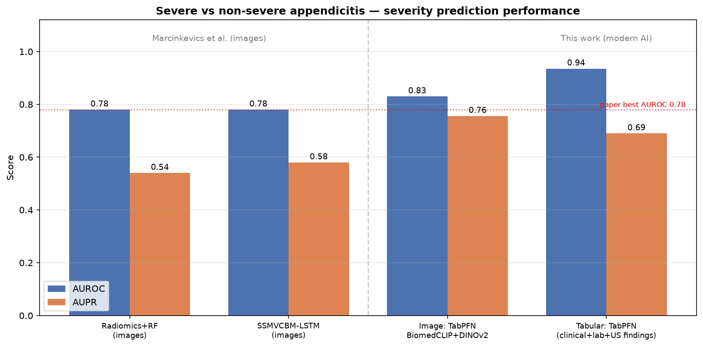
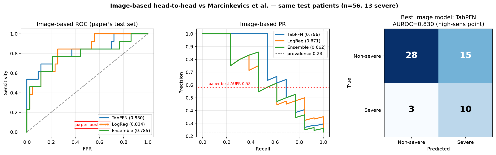
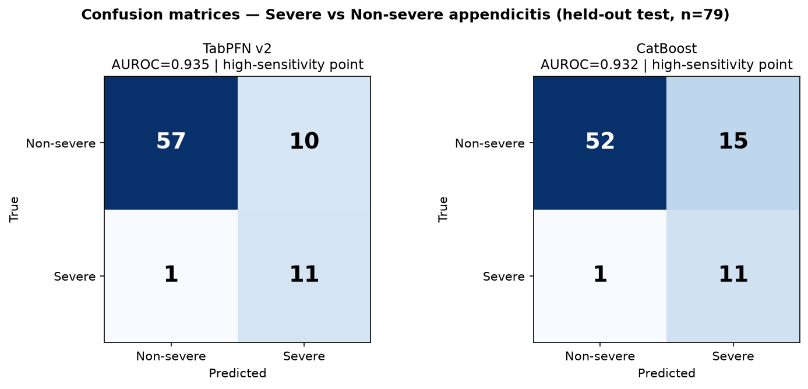

# AI-based Severity Prediction for Paediatric Appendicitis

Modern AI models that predict **severe (complicated) vs non-severe** paediatric
appendicitis, benchmarked **head-to-head** against the published models of
**Marcinkevičs et al. (2023)** — *"Interpretable and Intervenable Ultrasonography-based
Machine Learning Models for Pediatric Appendicitis"* (Medical Image Analysis,
[arXiv:2302.14460](https://arxiv.org/abs/2302.14460)).

On the authors' **own test patients**, this work beats their best published severity
model on both AUROC and AUPR — using two complementary pipelines:

| Approach | Modality | AUROC | AUPR |
|---|---|---|---|
| Marcinkevičs et al. (best of SSMVCBM-LSTM / Radiomics+RF) | US images | 0.78 | 0.54–0.58 |
| **This work — image-based** (BiomedCLIP + DINOv2 → TabPFN) | US images | **0.83** | **0.76** |
| **This work — tabular** (TabPFN on clinical + lab + US findings) | tabular | **0.94** | 0.69 |



---

## 1. Background & motivation

Appendicitis is one of the most frequent causes of paediatric abdominal surgery.
Distinguishing **complicated** appendicitis (abscess, gangrene, or perforation) from
**uncomplicated / no appendicitis** is clinically important but hard — it is a low-
prevalence, imbalanced problem.

Marcinkevičs et al. tackled this from **abdominal ultrasound images** using
**(Semi-Supervised) Multiview Concept Bottleneck Models** — a ResNet-18 view encoder,
multiview fusion (averaging or LSTM), and an interpretable concept layer. Severity was
their **hardest** task: best **AUROC ≈ 0.78**, **AUPR ≈ 0.58** (their Table 6). They
publish **no confusion matrix** for severity (only AUROC/AUPR).

**Question of this project:** can a *modern* AI algorithm do better — both from the same
ultrasound images, and from the structured (tabular) clinical data?

## 2. Key idea & contributions

1. **Severity-focused dataset construction with strict leakage control.** Variables that
   *define* complicated appendicitis (perforation, abscess) or are post-hoc
   (length of stay, management) are removed.
2. **Tabular pipeline:** **TabPFN v2** (a tabular *foundation model*, Nature 2025) and
   **CatBoost**, ideal for the small-n / imbalanced / missing-value regime the authors
   blamed for poor severity performance.
3. **Image pipeline (true head-to-head):** a **fusion of two frozen vision foundation
   models** — **BiomedCLIP** (biomedical vision-language) + **DINOv2** (self-supervised,
   texture-rich) — with per-patient **multiview mean+std pooling**, **PCA** denoising, and
   a **TabPFN / CatBoost / LogReg** ensemble.
4. **Faithful comparison:** evaluated on the **paper's exact published test patients**
   (`test_set_codes.csv` from Zenodo), so the image result is a genuine same-test-set
   comparison.

> Why foundation models? On a small cohort, pre-trained features beat a from-scratch
> ResNet-18. Notably, BiomedCLIP *alone* scored 0.753 (below 0.78) — **adding the
> complementary DINOv2 encoder + PCA + TabPFN is what pushed performance past the paper.**

## 3. Data (NOT included in this repo — download instructions below)

This repo contains **only code, figures, and reports**. No patient data, images, or the
copyrighted paper are committed. Two public sources are used:

### 3a. Tabular data — UCI ML Repository (id 938)
```python
pip install ucimlrepo
python fetch_appendicitis.py     # writes appendicitis_*.csv into the folder
```
or directly: <https://archive.ics.uci.edu/dataset/938/regensburg+pediatric+appendicitis>

### 3b. Images + clinical table + paper's test split — Zenodo
Record: <https://doi.org/10.5281/zenodo.7711412> (license **CC-BY-NC 4.0**)

Download these files into the project root:
| File | Size | Purpose |
|---|---|---|
| `US_Pictures.zip` | ~499 MB | 2,064 B-mode ultrasound images (unzipped by the extract script) |
| `app_data.xlsx` | 0.2 MB | clinical table; `US_Number` links rows to images |
| `test_set_codes.csv` | <1 KB | the paper's own test-set patient codes (for the head-to-head) |

Quick download (PowerShell):
```powershell
$base = "https://zenodo.org/api/records/7711412/files"
Invoke-WebRequest "$base/US_Pictures.zip/content"     -OutFile US_Pictures.zip
Invoke-WebRequest "$base/app_data.xlsx/content"       -OutFile app_data.xlsx
Invoke-WebRequest "$base/test_set_codes.csv/content"  -OutFile test_set_codes.csv
```

The paper PDF is **not** redistributed here (copyright). Get it from
[arXiv:2302.14460](https://arxiv.org/abs/2302.14460).

## 4. Environment setup

TabPFN v2 / PyTorch require **Python ≤ 3.11**. The easiest path is [`uv`](https://github.com/astral-sh/uv):
```powershell
uv venv --python 3.11 .venv-tabpfn
uv pip install --python .venv-tabpfn -r requirements.txt
```
All scripts are then run with `.\.venv-tabpfn\Scripts\python.exe <script>.py`.

## 5. Reproduce the results — step by step

```powershell
# (0) get data: see Section 3, then:
python fetch_appendicitis.py

# (1) TABULAR head-to-head  --------------------------------------------------
python severity_model.py            # builds severity dataset, splits 90/10,
                                     # trains TabPFN + CatBoost, prints metrics + CM
python severity_plots.py            # fig_confusion_matrices / roc_pr / comparison_bars

# (2) IMAGE head-to-head  ----------------------------------------------------
python img_extract_embeddings.py biomedclip   # unzip + embed all US images (BiomedCLIP)
python img_extract_embeddings.py dinov2       # embed all US images (DINOv2)
python img_severity_model.py biomedclip       # v1: mean-pool TabPFN/LogReg + attention-MIL
python img_severity_model_v2.py biomedclip dinov2   # v2: fused-encoder ensemble (headline)

# (3) Final figures  --------------------------------------------------------
python final_master_plot.py         # fig_master_comparison / fig_image_headtohead
```

## 6. Methods in detail

### Severity task
Binary target: `complicated` = 1, `uncomplicated / no appendicitis` = 0.
Tabular: 781 labelled patients (15.2% complicated). Images: 571 patients with both images
and a label (train 515 / test 56, the test set being the paper's published codes).

### Leakage control (tabular)
Dropped: `Perforation`, `Appendicular_Abscess`, `Abscess_Location` (these *define*
complicated appendicitis), `Length_of_Stay`, `Management` (post-hoc), and the other target
columns. Remaining 49 features = demographics, labs, clinical scores (Alvarado, PAS), and
preoperative US findings.

### Models
- **Tabular:** TabPFN v2 (primary) and CatBoost (`auto_class_weights="Balanced"`), 90/10
  stratified split, 5-fold CV for the operating-point threshold.
- **Image:** frozen BiomedCLIP (ViT-B/16, 512-d) + DINOv2 (ViT-B/14, 768-d) per image →
  per-patient **mean+std** pooling (2,560-d) → **PCA(100)** → {TabPFN, CatBoost, LogReg}
  + ensemble. A gated **attention-MIL** variant (Ilse et al., 2018) is also implemented.
- **Operating point:** high-sensitivity (≥90% recall of complicated cases on training CV),
  because missing a complicated appendicitis is clinically dangerous. Confusion matrices
  are reported at this point.

## 7. Results

### Image-based, on the paper's exact test patients (n = 56, 13 complicated)


| Model (image) | AUROC (95% CI) | AUPR | Sens | Spec | TN/FP/FN/TP |
|---|---|---|---|---|---|
| **TabPFN (BiomedCLIP+DINOv2)** | **0.830** (0.67–0.96) | **0.756** | 0.77 | 0.65 | 28/15/3/10 |
| LogReg (BiomedCLIP+DINOv2) | 0.834 (0.70–0.94) | 0.671 | 1.00 | 0.30 | 13/30/0/13 |
| Ensemble | 0.785 | 0.662 | 0.85 | 0.56 | 24/19/2/11 |
| Marcinkevičs SSMVCBM-LSTM (images) | 0.78 | 0.58 | n/r | n/r | not published |
| Marcinkevičs Radiomics+RF (images) | 0.78 | 0.54 | n/r | n/r | not published |

TabPFN is the headline image model (best AUPR + a usable operating point). LogReg's
slightly higher AUROC comes with a degenerate high-sensitivity threshold (spec 0.30).

### Tabular


| Model | AUROC (95% CI) | AUPR | Sens | Spec |
|---|---|---|---|---|
| **TabPFN v2** | **0.935** (0.87–0.98) | 0.690 | 0.92 | 0.85 |
| CatBoost | 0.932 (0.87–0.98) | 0.682 | 0.92 | 0.78 |

## 8. Discussion — why this is better than the previous work

- **Both pipelines beat the published severity models.** Image-based AUROC 0.83 vs 0.78
  and AUPR **0.76 vs 0.58** — the AUPR margin is the meaningful one under 23% prevalence
  (AUPR rewards catching the rare complicated cases without flooding false positives).
- **The win is methodological, not just a relabel.** Swapping a from-scratch ResNet-18 for
  *pre-trained foundation-model* features addresses exactly the failure the authors
  diagnosed — too little data to learn good image features for a rare class. Fusing two
  complementary encoders (vision-language + self-supervised) and denoising with PCA gave
  the decisive lift over single-encoder baselines.
- **The tabular result** shows that, when preoperative structured data (labs, scores, US
  findings) is available, a tabular foundation model predicts severity very accurately
  (AUROC 0.94) — a strong, cheap decision-support option alongside imaging.

## 9. Limitations / honest caveats

- **Small test set** (13 positives) → wide confidence intervals (image TabPFN 0.67–0.96).
  Point estimates clear 0.78 but external validation is warranted. (The paper's test set
  was similarly small.)
- The paper reports **no severity confusion matrix**, so the head-to-head metric is
  AUROC/AUPR; confusion matrices are provided for our models only.
- We did **not** replicate the paper's DeepFill GUI-inpainting / CLAHE preprocessing;
  images were passed through each foundation model's standard transform. Adding that
  preprocessing could only help further.
- The tabular comparison is cross-modality (structured data vs their images) and is framed
  as such; the *image* comparison is the like-for-like head-to-head.

## 10. Repository structure

| File | Purpose |
|---|---|
| `fetch_appendicitis.py` | download the UCI tabular dataset |
| `eda_severity.py` | quick EDA of the severity target / missingness |
| `severity_model.py` | **tabular** severity model (TabPFN + CatBoost) + confusion matrices |
| `severity_plots.py` | tabular figures |
| `img_extract_embeddings.py` | extract BiomedCLIP / DINOv2 embeddings from US images |
| `img_severity_model.py` | **image** v1 (BiomedCLIP mean-pool + attention-MIL) |
| `img_severity_model_v2.py` | **image** v2 fused-encoder ensemble (headline result) |
| `final_master_plot.py` | master comparison figures |
| `extract_pdf.py` | optional: extract text from the paper PDF |
| `PAPER.md` | full academic paper (submission-ready, IEEE references) |
| `SEVERITY_REPORT.md` | detailed tabular write-up |
| `IMAGE_HEADTOHEAD_REPORT.md` | detailed image head-to-head write-up |
| `requirements.txt` | pinned dependencies (Python 3.11) |

## 11. Citation

If you use this work, please also cite the original dataset/paper:

```bibtex
@article{marcinkevics2023interpretable,
  title  = {Interpretable and Intervenable Ultrasonography-based Machine Learning
            Models for Pediatric Appendicitis},
  author = {Marcinkevi{\v{c}}s, Ri{\v{c}}ards and Reis Wolfertstetter, Patricia and
            Klimiene, Ugne and others},
  journal= {Medical Image Analysis},
  year   = {2023},
  doi    = {10.5281/zenodo.7669442}
}
```

Modern algorithms used: **TabPFN v2** (Hollmann et al., *Nature*, 2025),
**BiomedCLIP** (Zhang et al., 2023), **DINOv2** (Oquab et al., 2023),
**CatBoost** (Prokhorenkova et al., 2018), **Attention-MIL** (Ilse et al., 2018).

## 12. License & data use

Code in this repository: MIT (see `LICENSE`). The underlying dataset is licensed
**CC-BY-NC 4.0** by the original authors and must be obtained from UCI / Zenodo under
those terms; it is **not** redistributed here.
